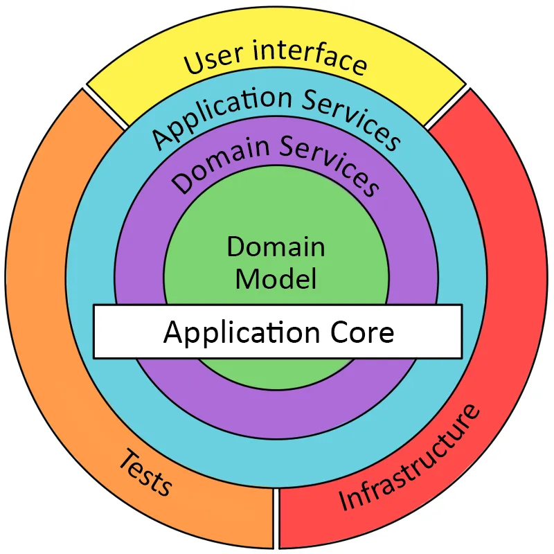
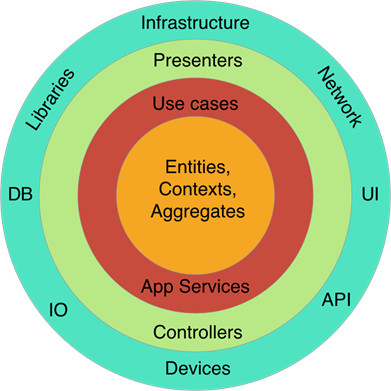

# ddd-concepts



## 🚀 Getting Started Testing

- Possuir o Bun runtime instalado

```bash
curl -fsSL https://bun.sh/install | bash
```

- Instalar as dependências

```bash
bun install
```

- Rodar o comando  `bun test` para executar os testes

```bash
bun test
```

---
⏭️ **Proxima Página:** [Concepts](docs/00-introduction.md)
